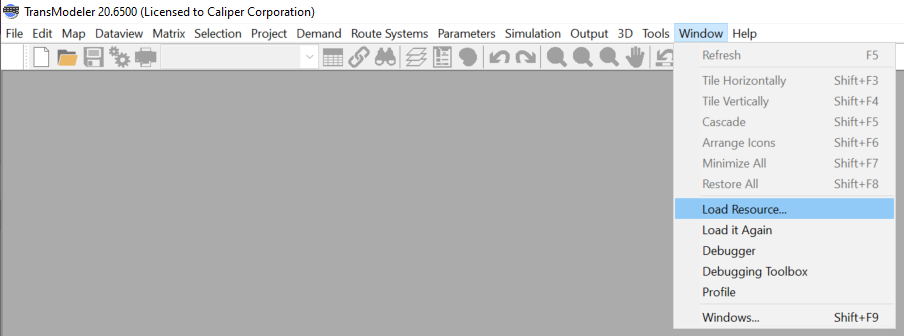
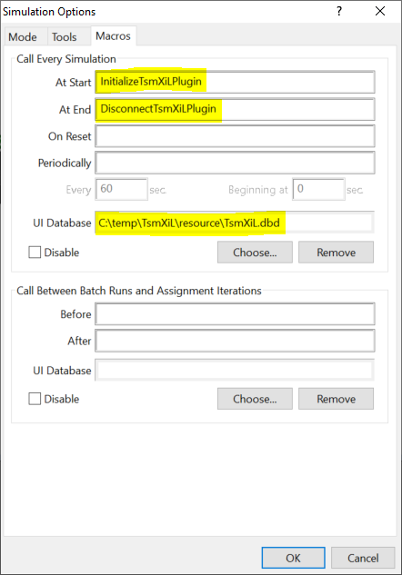

# TsmXiL Plugin

This is a plugin to model Vehicle-in-Loop in TransModeler traffic simulation. It is a class library (.dll) project.

## Load the plugin DLL in TransModeler

The plugin dll is loaded in TransModeler using the TsmXiL.rsc resource file. To load in TransModeler,

 1. Go to Window > Load Resource... menu item and choose the TsmXiL.rsc file\
 

 2. Go to Simulation > Options... menu item and in the Call Every Simulation section in the Macros tab specify -
    1. *InitializeTsmXiLPlugin* macro for "At Start"
    2. *DisconnectTsmXiLPlugin* macro for "At End"\
   

## Plugin functionality

The Manager.cs class connects this plugin with the TransModeler API and handles simulation events. The Start() method in Manager.cs is the entry point into the plugin code.

The Controller.cs class has an Update() method which is called during each simulation timestep which is set to a default value of 100 ms (or 1/10th of a second). The Update() method internally calls SendAccelCommand() method which sends the acceleration command to the controller and receives acceleration and speed in response.
